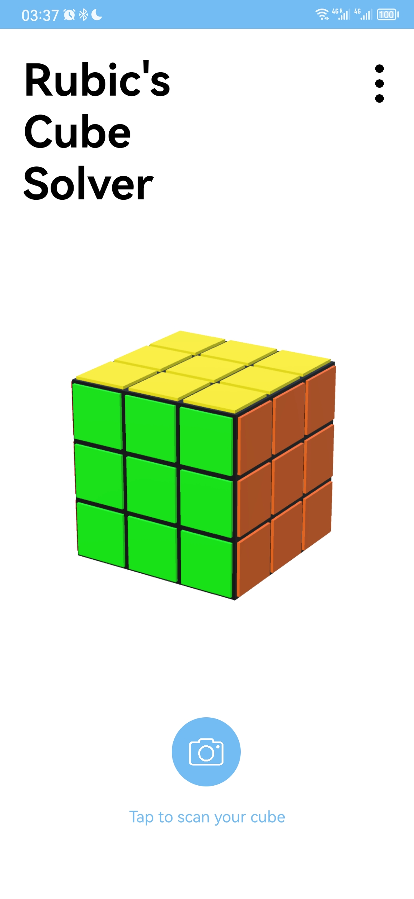
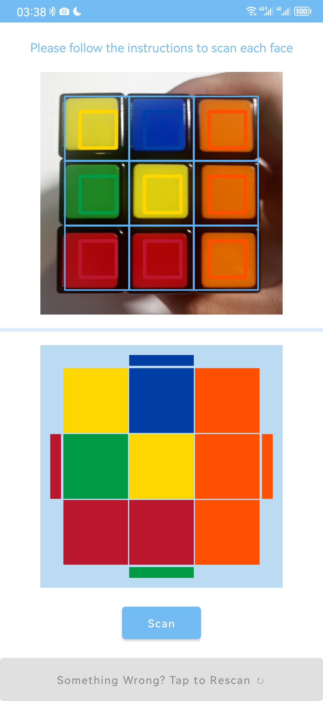
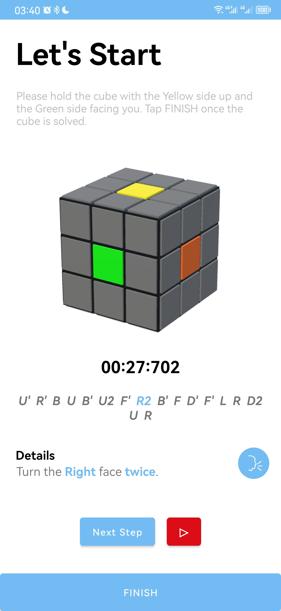
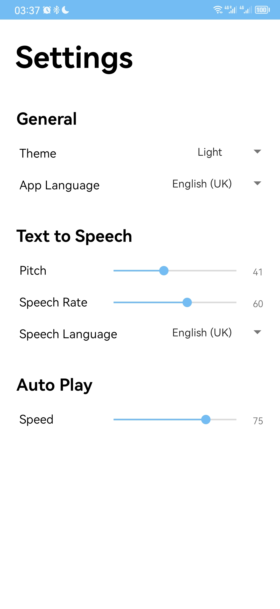

# CubeSolver

A 3x3x3 Rubik's Cube Solver

<p align="center">

</p>


## Key Features

- **Color Recognition:** Utilizes image processing techniques and computer vision algorithms for accurate color detection.
- **Cube Validator:** Checks if the scanned cube configuration is solvable.
- **Cube Solver:** Implements a 2-phase algorithm to generate the optimal solution.
  - The implementation of two-phase algorithm referenced this project: [cs0x7f/min2phase](https://github.com/cs0x7f/min2phase)

- **Voice Cues and Auto-play:** Enhances user experience with audio guidance and automatic progression of solving steps.
- **Timer and History Module:** Tracks and records solving times and dates for user performance analysis.
- **User Interface:** Offers a user-friendly, accessible design suitable for various skill levels and individuals with visual impairments.


## Project Structure

- **Manifests:** Defines runtime configurations like icons, name, permissions, etc.
- **Java Classes:** Contains the core logic and functionalities of the app.
- **Resources (res):** Includes drawable resources, layouts, launch icons, and constant definitions like strings and styles.
- **OpenCV Library:** Utilized for computer vision functionalities.
- **Gradle Scripts:** Manages compilation configurations and dependencies.


## Screenshots
<p align="center">
    <table>
    <tr>
        <td></td>
        <td></td>
        <td></td>
    </tr>
    <tr>
        <td></td>
        <td></td>
        <td></td>
    </tr>
    </table>
</p>


## Getting Started

### Installation

Down load the [apk](https://github.com/YankFitzgerald/CubeSolver/releases/tag/Publish) and install on your android devices.

### Debug in Android Studio

You will need to Integrate OpenCV first.
1. Download OpenCV SDK for Android

2. Unzip downloaded OpenCV SDK

3. Go to Android Studio
   - **File -> New -> Import Module**
   
   - Select **OpenCV-android-sdk/sdk**, click **Open**, name the module as "opencv"
   
   - Click **Finish**
   
   - You will have an exception in the **build.gradle** file
   
     ```bash
     * Exception is:
     org.gradle.api.GradleScriptException: A problem occurred evaluating project ':openCV'. <81 internal lines>
     at org.jetbrains.plugins.gradle.model.ProjectImportAction.execute(ProjectImportAction.java:116)
     at org.jetbrains.plugins.gradle.model.ProjectImportAction.execute(ProjectImportAction.java:42) <82 internal lines>
     Caused by: org.gradle.api.plugins.UnknownPluginException: Plugin with id 'kotlin-android' not found. <8 internal lines>
     at build_e4kzq4gccekt1idrn9dr74nup.run(/Users/pawandeepsingh/AndroidStudioProjects/opencv_integrate/openCV/build.grad
     ... 164 more
     ```
     Don't worry. You should have a `build.gradle(:opencv) ` file opened. Just add this code above `apply plugin: '.....'` lines.
     ```bash
     plugins {
        id 'org.jetbrains.kotlin.android' version '1.7.10'
     }
     ```
   - Now sync project with gradle scripts. (It will take some time to download all things needed)
4. Modify the `compileSdkVersion`, `minSdkVersion` and `targetSdkVersion` in `build.gradle(:opencv)`. Make it compact with module's **build.gradle** settings.
5. Go to **File -> Project Structure -> Dependencies**, Select **\<All Modules\>**, click **+** to add module dependency.
   - Click on app
   - Select the checkbox `opencv`
   - Click **OK**
   - Click **Apply** and **OK**
6. Now you should be able to run and debug the project. Otherwise, go to **Build -> Clean** Project then **Build -> Rebuild Project**.

---

Developed with ❤️&☕ by Ke Yan.

Supervised by Dr. Joshua Alcock.